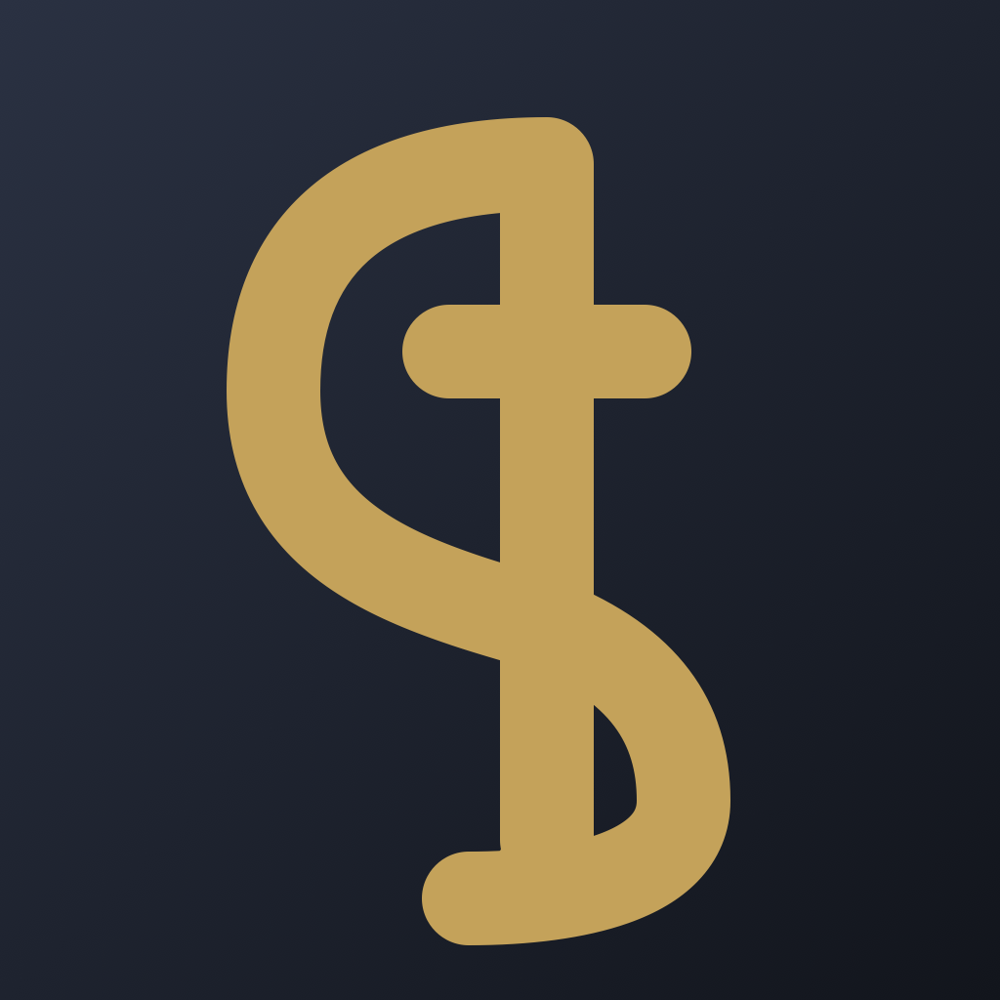

<p align="center">
  
</p>

<h1 align="center">Symphonia</h1>

<p align="center">
  <strong>Conduct the agent ensemble.</strong>
  <br>
  A native macOS workspace for running local coding agents in isolated Git worktrees.
</p>

<p align="center">
  <a href="https://github.com/adiutama/symphonia/releases"></a>
  <a href="https://github.com/adiutama/symphonia/actions/workflows/ci.yml"></a>
  <a href="LICENSE"></a>
  
</p>

Symphonia gives solo developers one place to create, run, and navigate multiple coding-agent sessions. Each session gets a real terminal and an isolated Git worktree; Symphonia manages the surrounding lifecycle, secrets, and keyboard-driven control.

It is not another coding agent or a full IDE. It is the native control plane around the CLI tools you already use.

> [!IMPORTANT]
> Symphonia is an early public MVP (`0.x`). Expect bugs and unfinished edges. Building from source is currently the most reliable way to use it; release DMGs may be unsigned.

## See Symphonia in action

https://github.com/user-attachments/assets/2f081110-9eaf-4293-b1fc-6d179eb4f6e4

## Why Symphonia?

Running several local coding agents usually means juggling terminal tabs, manually creating worktrees, copying `.env` files, and remembering which process belongs to which checkout. Symphonia turns those pieces into a coherent model:

- A **Workspace** is a project managed by Symphonia.
- **Main** is its protected primary Git checkout and home session.
- A **Worktree** is an isolated checkout with its own persistent Main CLI.
- **Overlays** provide editors and background terminals without filling the screen with panes.
- The **Secret Store** injects workspace-scoped environment variables when a CLI starts.
- The **Command Center** keeps app shortcuts separate from terminal input.

## Highlights

- **Worktree-native workflows** — create, switch, rename, archive, and remove Git worktrees from the app.
- **Real Ghostty terminals** — terminal rendering and input are powered by a pinned build of [GhosttyKit](https://github.com/ghostty-org/ghostty).
- **Persistent sessions** — switching Workspaces, Worktrees, or Overlays hides terminals without terminating their processes.
- **Main CLI plus Overlays** — keep the coding agent in focus and peek at an editor, server, watcher, or shell when needed.
- **Workspace Secret Store** — enable environment variables and groups without copying `.env` files into every checkout.
- **Keyboard-first control** — open the Command Center with `⌘⇧P`, use searchable commands, or run short command sequences.
- **Effective settings** — configure global defaults and override the CLI command, editor, Base Ref, or storage location per Workspace.
- **Native macOS experience** — SwiftUI chrome, AppKit terminal integration, Ghostty-derived colors, and Sparkle updates.

## Workspace model

Every Workspace is self-contained under `~/.symphonia/workspaces` by default:

```text
~/.symphonia/workspaces/my-project/
├── config.toml
├── secrets.toml
├── main/                  # protected primary checkout
├── blue-frog-knight/      # Git worktree + agent session
└── quiet-moon-harbor/     # another worktree
```

New Worktrees receive memorable three-word folder names. Their branches initially use the same name by default, but folder and branch identity can later diverge. The `main/` checkout is protected and automatically healed when a Workspace is opened.

For the complete product vocabulary, see [CONTEXT.md](CONTEXT.md). For the motivation and non-goals, see [the product vision](docs/vision.md).

## Getting started

### Requirements

- macOS 26 or newer
- Xcode 26
- Zig 0.16.x
- Metal Toolchain

Install the Metal Toolchain if it is not already available:

```bash
xcodebuild -downloadComponent MetalToolchain
```

### Build from source

Clone the repository, then build the two dependencies that are intentionally not committed:

```bash
git clone https://github.com/adiutama/symphonia.git
cd symphonia

./Terminal/scripts/build-ghosttykit.sh
./scripts/install-sparkle.sh
```

Open the project and run the **Symphonia** scheme with `⌘R`:

```bash
open Symphonia.xcodeproj
```

Or build it from the command line:

```bash
xcodebuild -scheme Symphonia -configuration Debug \
  -project Symphonia.xcodeproj \
  -derivedDataPath build/DerivedData \
  build
```

GhosttyKit is built from the exact upstream revision in [`Vendor/ghostty.pin`](Vendor/ghostty.pin). See the [Terminal guide](Terminal/README.md) for details about Ghostty resources and themes.

### Download a build

Stable and nightly DMGs are published on the [Releases page](https://github.com/adiutama/symphonia/releases) when available. Nightlies track the latest development on `main` and are more likely to contain regressions.

Unless a release explicitly says it is notarized, macOS may warn when opening it. Right-click the app and choose **Open**, or build from source. See the [release guide](docs/release.md) for signing and update-channel details.

## Keyboard workflow

The default Leader is `⌘⇧P`. It opens the Command Center and temporarily routes keystrokes to Symphonia instead of the focused PTY.

Common global shortcuts include:

| Action | Shortcut |
|---|---|
| New Workspace | `⌘N` |
| New Worktree | `⌘T` |
| Open Editor | `⌘E` |
| Overlay Terminal | `⌘J` |
| Toggle Overlay | `⌘⇧E` |
| Previous / next Worktree | `⌘[` / `⌘]` |
| Reload focused CLI | `⌘R` |
| Show keymap | `⌘⇧/` |

The Command Center also supports sequences such as `ww` to switch Workspace, `tt` to switch Worktree, and `ee` to open the editor. See the full [keymap](docs/keymap.md); sequences can be customized in Settings.

## Architecture

| Path | Responsibility |
|---|---|
| [`App/`](App/) | SwiftUI application entry, windows, sidebar, settings, and overlays |
| [`Domain/`](Domain/) | Workspace and Worktree lifecycle, preferences, secrets, and commands |
| [`Terminal/`](Terminal/) | AppKit-backed GhosttyKit terminal surfaces and input integration |
| [`docs/adr/`](docs/adr/) | Architecture Decision Records describing the major product seams |
| [`scripts/`](scripts/) | Dependency setup, linting, packaging, signing, and release helpers |
| [`Vendor/ghostty.pin`](Vendor/ghostty.pin) | Pinned upstream Ghostty revision |

The application deliberately separates SwiftUI chrome from the AppKit/Ghostty terminal island. State is coordinated through observable Domain controllers created at app launch. Read the [Domain guide](Domain/README.md), [Terminal guide](Terminal/README.md), and [ADRs](docs/README.md) for a deeper tour.

## Development

Run the fast checks used by pull requests:

```bash
./scripts/lint.sh
```

This runs ShellCheck, actionlint, and SwiftLint. It does not compile the application. To exercise the same Release compilation path used by tagged builds:

```bash
./scripts/ci-build.sh
```

Please use [Conventional Commits](https://www.conventionalcommits.org/) for commit messages, for example `feat(worktree): add archive action` or `fix(terminal): restore focus after overlay`.

## Project status

Symphonia is focused on the solo-developer, local-first workflow. Current non-goals include multi-user fleet management, cross-platform support, becoming an agent itself, and building a full graphical IDE.

- [Changelog](CHANGELOG.md)
- [Product vision](docs/vision.md)
- [Architecture decisions](docs/README.md)
- [Release process](docs/release.md)

Issues and focused pull requests are welcome. Because the project is still evolving quickly, opening an issue before a large change is recommended.

## License

Symphonia is available under the [MIT License](LICENSE).

Ghostty and libghostty remain under their own MIT license. Symphonia vendors a pinned GhosttyKit build recipe and does not re-license the upstream project.
